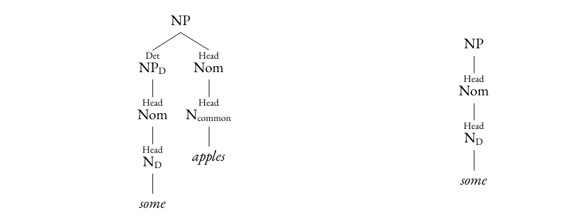
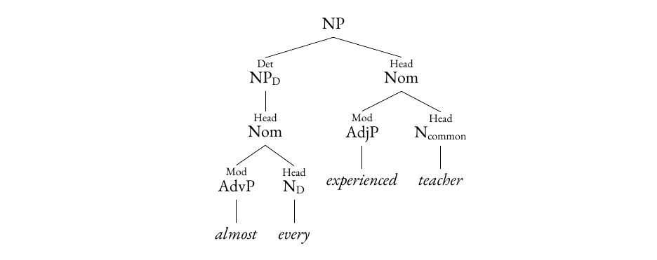
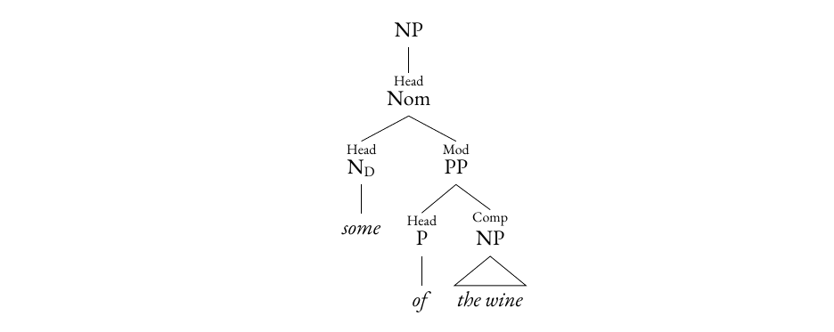

# English determinatives as nouns
Brett Reynolds  
Humber Polytechnic & University of Toronto  
Draft, September 2026

Reading copy for comments. [Typeset PDF](./determinatives-as-nouns.pdf).
## Abstract
I argue that English determinatives, including articles, demonstratives and quantifiers, form a subcategory of Noun alongside common nouns, proper nouns and pronouns. I develop this analysis through comparisons of independent uses, partitives and modification, supported by corpus attestations. Determinatives retain their lexical identity across dependent and independent uses. An explicit set of grammatical rules gives independent determinatives the phrase structure already needed for other nouns, while retaining lexical restrictions on words such as _every_ and _the_. Independent determinatives fill ordinary head function instead of jointly filling determiner and head functions. A reanalysis of published data on grammatical properties confirms differences between the coded profiles of determinatives and pronouns. Those differences are compatible with both categories belonging to Noun.

**Keywords:** determinatives, nouns, lexical categories, noun phrases, English
## 1. The question
{++What is the categorial relationship among words like some, me, apple, and Brett?++}{id="s29" by="user" at="2026-09-07T19:45:52.413Z"} When offered apples, a speaker can say either _I’ll take some apples_ or _I’ll take some_. The word _some_ quantifies over apples in both expressions, but only the first contains a common noun. A grammar must describe both uses and explain their relation. {==Calling _some_ a determinative before _apples_ and a pronoun when used independently is one response. Keeping _some_ in one lexical category is another.==}{>>this fails to set out the range of options or uniquely identify the one I pick. Which isn't to say that it should set out the full range of options, but the paper certainly should not start with ambiguity like this.<<}{id="c1" by="user" at="2026-09-07T17:44:05.549Z"}{>>perhaps this isn't the place to set it all out, but some acknowledgement should come here, I expect. When it's set out, perhaps it should be tabular or in a set of trees<<}{id="c8" by="user" at="2026-09-07T19:47:15.060Z" re="c1"}

{==I keep _some_ in one category across its uses.==}{>>this fails to set out the range of options or uniquely identify the one I pick. Which isn't to say that it should set out the full range of options, but the paper certainly should not start with ambiguity like this.<<}{id="c1" by="user" at="2026-09-07T17:44:05.549Z"}{>>perhaps this isn't the place to set it all out, but some acknowledgement should come here, I expect. When it's set out, perhaps it should be tabular or in a set of trees<<}{id="c8" by="user" at="2026-09-07T19:47:15.060Z" re="c1"} Following _The Cambridge grammar of the English language_ (_CGEL_; Huddleston and Pullum 2002), I use determinative for the category containing articles, demonstratives and quantifiers such as _the_, _this_, _some_, _every_ and _many_. I reserve determiner for a {++syntactic++}{id="s1" by="user" at="2026-09-07T17:45:18.202Z"} function within the noun phrase. The distinction separates what kind of word _some_ is from what its phrase does.

I propose that determinatives belong within a broader noun category, alongside common nouns, proper nouns and pronouns. These four subcategories are coordinate: they occupy the same level in the classification. Capitalized {==NOUN==}{>>this appear uncapitalized in all caps<<}{id="c2" by="user" at="2026-09-07T17:46:14.477Z"} names the superordinate category when the distinction matters. A determinative such as _some_ is thus also a noun in both dependent and independent uses{++, though never a sub-category or pronoun (nor are pronouns a sub-category determinatives)++}{id="s2" by="user" at="2026-09-07T17:46:55.832Z"}{==.==}{>>note, I'm not suggesting a particular wording. And you're free to adopt/adapt/reject as you see fit (with explanation if you reject). You can also use the idea but relocate it, etc.<<}{id="c3" by="user" at="2026-09-07T17:47:53.157Z"}

The potential gain is a shared account of phrase structure. Independent _some_ would head a noun phrase through the same rules as other nouns. Two comparisons are needed: with CGEL, which places determinatives outside noun, and with Hudson’s analysis, which places the words he calls determiners within pronoun and pronoun within noun (Hudson 2004; Hudson 2010). Evidence for nounhood alone doesn’t decide between coordinate subcategories and Hudson’s nesting.

{++To head off a likely misunderstanding:++}{id="s3" by="user" at="2026-09-07T19:23:20.571Z"} {--U--}{id="s4" by="user" at="2026-09-07T19:23:34.416Z"}{++u++}{id="s5" by="user" at="2026-09-07T19:23:36.001Z"}nder the proposal, _apples_ still ultimately heads the whole noun phrase _some apples_. Assigning _some_ to Noun doesn’t adopt the DP hypothesis, in which functional D heads the whole expression (Abney 1987). The claims concern synchronic English lexical categories.

I first work through the structural comparison, then consider independent uses, partitives and modification. Corpus examples and a reanalysis of published determinative–pronoun data establish the empirical scope. A final set of grammatical rules makes the proposed simplification and its remaining restrictions explicit.
## 2. Classification, headedness and function
### 2.1 {==Three decisions==}{>>consider whether it's worth laying out a wider range of possibilities: nouns, pronouns, and determinatives are three distinct categories at the same level at on extreme vs there is only one super category with one sub-category and one sub-sub-nested category. All told, this gives us quite a range of possible positions, many of which have been claimed (by CGEL, Hudson, Postal, and Sommerstein, and perhaps Abney), and now I'm claiming one that nobody has, heretofore, claimed.<<}{id="c4" by="user" at="2026-09-07T19:24:48.859Z"} a grammar must make
Start with _some apples_ and independent _some_. In {==CGEL==}{>>should always be in italics<<}{id="c7" by="user" at="2026-09-07T19:41:25.498Z"}, _some_ is a determinative in both. Before _apples_, its phrase functions as determiner. Independently, _some_ jointly fills the determiner and head functions: CGEL calls this fusion of functions (Huddleston and Pullum 2002, 410–12). {~~The~>My~~}{id="s6" by="user" at="2026-09-07T19:31:39.699Z"} proposal{++, which I'll refer to as the++}{id="s7" by="user" at="2026-09-07T19:31:45.896Z"} {++D-noun analysis++}{id="s7" by="user" at="2026-09-07T19:31:45.896Z"}{>>another possibility is the co-noun analysis. You might have better ideas. Whatever we land on, carry it through<<}{id="c6" by="user" at="2026-09-07T19:33:58.229Z"}{++,++}{id="s7" by="user" at="2026-09-07T19:31:45.896Z"} retains the determinative category but makes it a noun subcategory{++, alongside common, proper, and pronoun++}{id="s9" by="user" at="2026-09-07T19:32:47.536Z"}, allowing independent _some_ to function as an ordinary head. Table 1 isolates the comparison.

| Expression | CGEL | {~~Nominal~>D-noun~~}{id="s10" by="user" at="2026-09-07T19:33:32.308Z"} analysis |
| :--- | :--- | :--- |
| _some apples_ | A determinative phrase {++(DP)++}{id="s11" by="user" at="2026-09-07T19:35:03.787Z"} headed by _some_ functions as determiner {++in the larger NP ultimately headed by++}{id="s13" by="user" at="2026-09-07T19:35:19.872Z"}{--;--}{id="s12" by="user" at="2026-09-07T19:35:18.159Z"} _apples_ {--ultimately heads the larger NP--}{id="s14" by="user" at="2026-09-07T19:35:32.899Z"}. | A{++n NP++}{id="s16" by="user" at="2026-09-07T19:35:44.008Z"} {--noun phrase--}{id="s15" by="user" at="2026-09-07T19:35:42.969Z"} headed by {++the determinative noun (N_D)++}{id="s26" by="user" at="2026-09-07T19:40:36.301Z"} _some_ functions as determiner{~~;~>in the larger NP ultimately headed by~~}{id="s17" by="user" at="2026-09-07T19:36:06.548Z"} _apples_ {--ultimately heads the larger NP--}{id="s18" by="user" at="2026-09-07T19:36:11.658Z"}. |
| _some_ in _I’ll take some_ | {++A++}{id="s19" by="user" at="2026-09-07T19:36:27.045Z"} {--_S_--}{id="s20" by="user" at="2026-09-07T19:36:29.124Z"}{++_s_++}{id="s21" by="user" at="2026-09-07T19:36:29.999Z"}_ome_ {++DP++}{id="s22" by="user" at="2026-09-07T19:36:36.479Z"} {~~is a determinative in~>functions as a~~}{id="s23" by="user" at="2026-09-07T19:36:59.508Z"} fused determiner–head {--function--}{id="s24" by="user" at="2026-09-07T19:37:18.373Z"} within an NP. | _Some_ is a{++n++}{id="s28" by="user" at="2026-09-07T19:41:08.609Z"} {--determinative noun--}{id="s27" by="user" at="2026-09-07T19:41:07.311Z"} {++N_D++}{id="s25" by="user" at="2026-09-07T19:39:57.160Z"} in ordinary head function within an NP. |

Table 1. The same expressions under CGEL and the proposed nominal analysis. Both accounts retain the lexical identity of _some_; they differ in its superordinate category and in the structure assigned to its independent use.

The proposal lets independent _some_ use ordinary noun-phrase structure. Lexical restrictions remain: _every apple_ is grammatical, but *_I’ll take every_ isn’t an ordinary way to accept apples. Making _every_ a noun doesn’t give it every use available to _some_. Section 8.1 states the structural rules and lexical restrictions separately so that their contributions can be assessed.

Category, headedness and function therefore require separate decisions. A category assignment says which lexical generalizations apply to a word. A headedness analysis identifies a phrase’s organizing head. A function label identifies a constituent’s relation to its containing construction. An NP can function as determiner, as in _Kim’s book_, and a determinative-headed phrase can have another function, as in _the many people_ (Payne et al. 2010; Pullum and Miller 2022).

For the trees below, a nominal (Nom) contains a head noun and its internal dependents, excluding an external determiner. A lexical noun heads a Nom, which heads an NP; this sequence is nominal projection, and the noun is the NP’s ultimate head. Within _almost every experienced teacher_, _almost every_ functions as determiner and _experienced teacher_ as head nominal. Within the determiner phrase, _almost_ modifies _every_.

I abbreviate noun and determinative as N and D, and determiner and modifier functions as Det and Mod. Det–Head marks fusion. In the proposed trees, NPD is an NP headed by a determinative noun; the subscript identifies a subcategory. CGEL’s determinative phrase, abbreviated DP here, is a dependent phrase in _some apples_, distinct from the whole expression called DP under the DP hypothesis.

Earlier nominal accounts also distinguish underlying structure from surface classification. Postal (1966) unifies personal pronouns and articles through an underlying article analysis. Sommerstein (1972, 197–203) reverses the direction, assigning underlying NP structure to the definite article and personal pronouns, with relative-clause structures contributing further descriptive material. Sommerstein’s comparison of inserting and deleting _one_ addresses the representation of pronouns and count versus non-count expressions.

Lyons (1968, 232–35) supplies a useful methodological distinction: distribution can be compared at different levels of categorization. Two expressions may belong together at one level and differ at a more specific level. His discussion of articles, demonstratives and personal pronouns also emphasizes shared definiteness and deictic contrasts (Lyons 1968, 279).
### 2.2 The nearest alternatives
The structural comparison in Table 1 leaves a further taxonomic choice open. CGEL places common nouns, proper nouns and pronouns within noun, while treating determinative as a separate primary category. Once determinatives are included within Noun, they could form a subcategory alongside pronoun or fall within a broader pronoun category.

Hudson’s nominal analysis makes a different choice. In Hudson (2010, 253–54), noun has the subcategories common noun, proper noun and pronoun. Hudson identifies the words he calls determiners by valency: the kinds of dependent an item permits. In Hudson’s terminology, a determiner is a pronoun that permits the relevant common-noun dependent (Hudson 2004, 9–10). Identifying these words doesn’t require another category node.

CGEL and Hudson classify different inventories. Hudson’s criteria in the 2004 paper centre on licensing a singular count common noun and on mutual exclusion in that use. He sets aside _all_, cardinal numerals and quantifiers restricted to plural or non-count nouns. CGEL’s determinative category is broader. Comparing the classifications therefore requires checking which words and constructions each covers.

Hudson also separates dependency from phrase headedness. His 2004 account permits mutual dependency between determiner and common noun, with different constructions selecting different external heads (Hudson 2004, 7–9). Temporal adjuncts provide an illustration: _We met that day_ depends on the temporal meaning of _day_. Such restrictions support a common-noun head for temporal adjuncts (Hudson 2004, 10–12).

The alternative to a separate primary D needn’t preserve a unified determinative subcategory. Spinillo (2004) proposes redistribution among existing categories, retaining _the_, _a_ and _every_ as an expanded article category. That proposal makes the restricted members a separate category; the fourfold analysis retains them inside the wider determinative subcategory.

Van Eynde (2003) likewise rejects a separate determiner category, but assigns determining expressions to adjective or noun on morphological and agreement evidence, chiefly from Italian and Dutch. His analysis separates lexical category from the features governing determination. A noun-headed NP account therefore needn’t unify every determining expression as nominal.

Table 2 summarizes the taxonomic alternatives. Their phrase architectures and lexical inventories also differ, as the source comparisons above show.

| Analysis | Taxonomy | Treatment of the dependent/independent relation |
| :--- | :--- | :--- |
| CGEL | Noun contains common, proper and pronoun; D is outside noun | D remains D; independent uses can involve fusion. |
| Hudson | Noun contains common, proper and pronoun; the words he calls determiners are within pronoun | Valency identifies his determiners. |
| Present | Noun contains common, proper, pronoun and D | D remains D and inherits nominal projection; constructional and lexical restrictions remain. |

Table 2. The principal taxonomic alternatives. Membership and phrase architecture must be checked separately.
## 3. A fourfold nominal analysis
### 3.1 What the subcategories share
What would determinatives share with other nouns? Under the proposal, members of all four subcategories can supply a lexical head for a Nom within an NP. Rules for subcategories and lexical entries constrain when and how this phrase structure is available.

An argument NP headed by a singular count common noun normally requires a determiner; NPs headed by plural or non-count common nouns often don’t. Proper nouns and pronouns have their own restrictions on determination and modification. Personal pronouns also contrast in case forms and are organized by person, number and gender (Huddleston and Pullum 2002, 425–27). The superordinate category already accommodates substantial differences among its subcategories.

The determinative proposal extends that division of labour. Projection rules apply to Noun as a whole; more specific rules describe determinative combinatorics. Lexical entries distinguish, for example, _some_, which has independent uses, from _every_, which doesn’t.

By inheritance I mean that a property stated for a superordinate category is available to its subcategories, subject to stated restrictions. The proposed hierarchy is useful insofar as it captures shared grammatical properties; drawing an inheritance edge doesn’t establish them.
### 3.2 Dependent and independent uses
Figure 1 gives the proposed analyses of _some apples_ and independent _some_. Function labels appear above category labels. In the first tree, the inner NPD functions as Det within an NP ultimately headed by the common noun _apples_. In the second, the determinative noun _some_ supplies the lexical head of the object NP. The lexeme has the same subcategory in both trees; its containing phrase has a different function.

**Figure 1.** The proposed analyses of _some apples_ (left) and independent _some_ (right). Follow the ND–Nom–NP sequence above _some_: it is shared across uses. The resulting phrase functions as Det on the left and as the object in _I’ll take some_ on the right.

The NP headed by _some_ inside _some apples_ isn’t interchangeable with every NP. The determiner construction selects a determinative-headed phrase, a suitable genitive NP, or another licensed expression. Section 8 includes this restriction in the comparison of grammars.
### 3.3 Two heads in one expression
Figure 2 separates the two modifier relations in _almost every experienced teacher_. The AdvP _almost_ modifies the determinative noun _every_; the AdjP _experienced_ modifies the common noun _teacher_, which ultimately heads the outer NP.

**Figure 2.** Two modifier relations in _almost every experienced teacher_: _almost_ modifies _every_, and _experienced_ modifies _teacher_. The outer NP has _teacher_ as its ultimate head. Internal structure within the one-word modifier phrases is suppressed.

The trees preserve a contrast emphasized by Payne et al. (2010): _hardly any_ and _almost anybody_ have adverbial modifiers, while expressions such as _nothing absolute_ permit adjectival postmodification. The proposed Noun category therefore includes adverbially modified heads as well as common nouns preceded by adjectives, as in _experienced teacher_.

Genitive NPs show how a noun can head a phrase in determiner function. In _Kim’s book_, the genitive NP functions as Det, while _book_ ultimately heads the larger NP (Figure 3). The proposal extends this use of NPs to phrases headed by determinatives.

**Figure 3.** The genitive NP _Kim’s_ functions as determiner within _Kim’s book_, ultimately headed by _book_. The representation abstracts from the internal realization of genitive marking.

Nounhood also remains compatible with fusion. CGEL analyses _mine_ as fused Det–Head when it stands for a possessed entity in an anaphoric context, but as pure Head in the predicative possessive use _it’s mine_ (Huddleston and Pullum 2002, 410–11).
## 4. Evidence for nominal structure
### 4.1 The range of independent uses
Independent use is widespread within the determinative inventory. CGEL discusses such uses for demonstratives and quantifiers including _some_, _all_, _both_, _many_, _few_, _several_, _each_, _either_, _neither_, _much_ and _enough_, while recording lexical restrictions and the separate forms _no_/_none_ (Huddleston and Pullum 2002, 371–72, 410–24). The generalization is about the availability of constructions across a lexical category, not the unrestricted acceptability of every member in every sentence frame.

In the constructed examples in (1), compare the positions occupied by the bracketed NPs: subject, object and complement of a preposition. Assume that a woman named Kim and a group of people are already under discussion. These positions admit NPs containing words from each proposed noun subcategory; the competing analyses assign different internal structures to independent _some_.

(1a) _[People] left. I see [people]. with [people]_

(1b) _[Kim] left. I see [Kim]. with [Kim]_

(1c) _[She] left. I see [her]. with [her]_

(1d) _[Some] left. I see [some]. with [some]_

The pattern extends beyond a few compounds or a single lexicalized expression. For this closed category, productivity concerns the availability of independent use among established members under appropriate conditions, rather than the licensing of new lexical items.

Adjectival independent uses prevent a simple inference from external distribution to nounhood. _The rich_ and _the poor_ can fill nominal argument positions. Comparative and superlative adjectives also head expressions without a human-class interpretation: CGEL’s _the most important of her criticisms_ is an NP containing a partitive _of_-phrase (Huddleston and Pullum 2002, 332–33, 416–23).

Independent _some_ can form a one-word NP, whereas an NP with _rich_ as fused head normally requires a determiner on the human-class reading. That is a local contrast: argument NPs headed by singular count common nouns also need determination.
### 4.2 Completeness and contextual interpretation
With a group of people under discussion, _Some left_, _Many came_ and _All agree_ illustrate structural saturation: an argument expression can be syntactically complete without another overt head or determiner.

Syntactic completeness differs from contextual interpretation. In _I’ll take some_, the relevant substance or set may be supplied by discourse or the situation. That dependence doesn’t establish a deleted common noun: ordinary pronouns also depend on context.

Generalizing expressions such as _Many are called, few are chosen_ and _Enough is enough_ need no previously uttered common-noun phrase. They rule out a mandatory overt-antecedent requirement, but a silent-noun account could supply a generic restriction. Such examples don’t decide whether the restriction belongs in semantics or syntax.

A silent-noun analysis, fusion and ordinary headedness should be compared by what each explains. A silent noun is useful if its properties predict a restriction that an overt-head analysis misses. Fusion is useful if jointly filling two functions predicts available dependents or interpretations. Ordinary nominal projection is useful if it captures independent uses with restrictions already needed for the words concerned.
### 4.3 Partitives locate the quantificational head
In _some of the wine_, _some_ specifies a quantity drawn from an identifiable amount of wine. The NP _the wine_ denotes the partitive domain: the whole from which that quantity is drawn. This NP is complement of _of_. A pronoun-headed NP or independent genitive NP can express the domain too: _many of them_, referring to previously mentioned people, or _some of Kim’s_, referring to Kim’s apples.

Compare where the common noun occurs in _some apples_ and _some of the wine_. In the partitive, _wine_ is embedded inside the _of_-phrase, so it can’t be the lexical head of the whole NP. The determinative _some_ has an organizing role in that larger expression.

Figure 4 gives the nominal analysis, with the _of_-phrase functioning as a post-head modifier, following CGEL (Huddleston and Pullum 2002, 411). The inner NP _the wine_ is abbreviated.

**Figure 4.** The proposed structure of _some of the wine_. Follow the Head relations from the outer NP to _some_. The common noun _wine_ is inside the modifying PP and doesn’t head the whole expression.

CGEL accounts for these facts through Det–Head fusion. Partitives support the determinative’s head-like role, while leaving the choice between fusion and ordinary headedness open.

The ordinary-Head proposal treats _some_ and _some of the wine_ as sharing nominal projection, with an added domain phrase in the partitive. Modification provides a further comparison of internal structure.
### 4.4 Modification tests the internal analysis
The pair _the lucky survivors_/_the lucky few_ makes the case for ordinary nominal structure particularly visible. In the proposed analysis of the second expression, _the_ determines a Nom containing the modifier _lucky_ and the head _few_ (Figure 5). The overt determiner and the overt quantificational head fill separate functions.

**Figure 5.** The proposed structure of _the lucky few_. Determiner and head are separately realized: _the_ determines a nominal headed by _few_ and modified by _lucky_. Internal structure within the article phrase and AdjP is suppressed.

Alternative analyses can place _lucky_ with a silent nominal element or treat this use of _few_ as a converted common noun. The comparison turns on how well each predicts the available dependents.

The modifiers in _hardly any_ and _almost every_ are adverbs; corresponding attributive adjectives aren’t licensed. The pattern in _the lucky few_ is likewise restricted. The nominal analysis retains these lexical differences.

Nor is adjectival premodification exclusive to determinatives: _the idle rich_ has an adjectival fused head. Internal modification distinguishes particular constructions, rather than providing a categorical nounhood test.

Lexical breadth motivates a category-level account of independent use; syntactic completeness shows that no further overt nominal element is required; modification supplies the internal structures and restrictions that the account must capture.
### 4.5 What remains of fusion
Payne et al. (2007) characterizes fusion through six properties. One constituent fills two adjacent functions: head and a dependent function of the same phrase or of an immediate dependent. The fused constituent typically differs in category from its containing phrase. Two further properties connect fusion to a non-fused counterpart: the containing phrase projects from the counterpart’s head category, and the fused constituent has the counterpart’s dependent category. In _some apples_/_some_, NP is the containing category and D is the category of the dependent or fused constituent.

In the ordinary-Head variant, independent _some_ fills Head alone. Locality and adjacency consequently have no two-function relation to constrain. Projection rules supply the N–Nom–NP sequence. The word _some_ retains its lexical identity across dependent and independent uses, while its phrases fill different functions.

Payne et al. (2007) also explicitly ties the exclusion of independent _every_ and the form _none_ to lexical differences in fusion licensing. The nominal account still needs those differences, now stated as permissions for independent use and form selection. Section 8.1 holds those permissions fixed when comparing the structures.

Adjectival fusion is retained. In _the rich_, _rich_ remains adjectival and realizes fused Mod–Head within Nom; the article-headed phrase fills Det. In _the idle rich_, _idle_ modifies that nominal. The broader independent distribution of determinatives motivates ordinary nominal projection for that category, while the restricted adjectival constructions retain their separate analysis.

Compounds require further description. For _hardly anyone present_, Payne et al. (2007) uses determinative-phrase structure to license the pre-head adverb and NP structure to license the post-head adjective. An ordinary-Head analysis needs subcategory and constructional restrictions to preserve this contrast inside Noun. The rules in §8.1 cover simple determinatives; they don’t complete the analysis of compounds.
## 5. What the empirical record establishes
### 5.1 A reproducible corpus inventory
CGELBank is a corpus of English sentences annotated using categories and functions developed from CGEL (Reynolds et al. 2023). It supplies inspectable examples with stable sentence identifiers. Its category and fusion labels already encode analytical decisions, so label counts can’t independently establish that CGEL or the proposed replacement is correct.

I inventory four CGELBank datasets containing 220 sentence trees and 3,390 lexical nodes with overt text. Of those nodes, 387 are annotated D. Table 3 compares selected forms by their local function. These are counts of annotated uses, not estimates of a lexeme’s capacity for independent use. Appendix A gives the source revision, selection criteria and extraction procedure; an accompanying concordance preserves the sentences and their identifiers.

The sample has no determinative tokens of bare _few_, _either_ or _neither_. Their absence limits the corpus evidence for the range of independent uses discussed in §4.

| Form | Total | Det | Det–Head | Other |
| :--- | ---: | ---: | ---: | ---: |
| _the_ | 129 | 129 | 0   | 0   |
| _a_ | 90  | 89  | 0   | 1   |
| _every_ | 3   | 3   | 0   | 0   |
| _this_ | 28  | 21  | 7   | 0   |
| _that_ | 12  | 5   | 7   | 0   |
| _some_ | 5   | 3   | 2   | 0   |
| _all_ | 11  | 3   | 5   | 3   |
| _both_ | 4   | 2   | 1   | 1   |
| _many_ | 3   | 0   | 1   | 2   |
| _a few_ | 2   | 1   | 1   | 0   |
| _each_ | 2   | 0   | 1   | 1   |
| _enough_ | 6   | 2   | 1   | 3   |

Table 3. Selected forms by local function in CGELBank. Compare forms attested in both Det and Det–Head uses with forms restricted to Det in this sample. Other includes all remaining functions. Counts group forms by corpus lemma, including singular and plural demonstratives.

All 65 Det–Head occurrences were inspected in their source sentences. They include ordinary arguments, partitives, compounds such as _something_, floating quantifiers, degree and frequency expressions, numerical fragments and age supplements. Within _about 30 seconds_, for example, the numeral’s nominal projection is embedded in the determiner _about 30_. Reporting all 65 occurrences as independent argument uses would conflate different constructions.

Two attestations illustrate independent quantifiers with a recoverable domain:

(2a) _Went there yesterday: we are trying to decide between two different Honda models, so we wanted to test-drive both back to back._

(2b) _I rarely listen to the news or to what politicians or lawyers say because so many tell lies that none have credibility so what’s the point?_

In (a), _both_ refers to the two Honda models. In (b), _politicians or lawyers_ supplies a domain for _many_ and _none_. These attestations illustrate independent quantifiers whose interpretation is supplied by preceding discourse. Appendix A identifies the source sentences.

CGELBank also attests _I need something reliable and good looking_; the concordance gives the sentence identifier. The adjectives follow the compound determinative _something_, contrasting with the premodification in _the lucky few_.

The inventory attests independent and internally expanded determinatives, but provides no representative productivity estimate or controlled test of the modifier contrasts. The constructed examples in §4 remain grammatical judgments.
### 5.2 What distributional differences establish
Do determinatives and pronouns differ too much to belong to the same broader category? Reynolds (2021b) compared 73 determinative forms and 65 pronoun forms using a binary feature matrix: each row is a form, and each column records a morphological, phonological, semantic or syntactic property. The matrix contains no common or proper nouns, so it can establish differences between the two supplied categories but can’t test nounhood directly.

Two statistical methods answer different questions. DISCO tests separation between preassigned groups; k-groups searches for two clusters without using category labels. The DISCO tests confirm separation across several feature selections. The clustering is less stable: with the public matrix, agreement with CGEL’s classification ranges from 75 to 132 of 138 forms across random starts. The original report of 129 matches is attainable, but depends on initialization. Agreement also changes with feature selection.

Differences between coded profiles don’t determine taxonomic rank: subcategories of one category can differ sharply. The reanalysis supports distributional separation between the determinative and pronoun forms in this inventory, while leaving their classification within Noun open. Reynolds’s original discussion likewise recognized significant divisions within categories and left a nested nominal analysis open (Reynolds 2021b).

Appendix A gives the methods and sensitivity results, including a discrepancy between the reported 232 features and the 155 in the public file (Reynolds 2021a). The comparisons are exploratory; agreement with CGEL’s labels isn’t accuracy against an independent ground truth.
## 6. Coordinate subcategories and inheritance
Should determinatives and pronouns be coordinate subcategories, or should determinatives belong inside pronoun? The matrix reanalysis leaves that choice open. Its pronoun rows follow CGEL’s classification, whereas Hudson’s pronoun category includes the words he calls determiners. Comparing these hierarchies requires aligning their lexical inventories and asking which generalizations can be stated for each superordinate category.

The case for coordinate subcategories starts from the different concentrations of grammatical properties. Core personal pronouns have case contrasts, reflexive forms and person distinctions. Determinatives organize contrasts in quantification, determination and degree modification. These descriptions allow exceptions and further subtypes; their role is to preserve the local grammatical distinctions within a shared nominal architecture.

Within the proposed grammar, nominal projection rules apply to all four subcategories, so they can be stated for Noun as a whole. An intermediate pronoun-plus-determinative category would need to capture additional generalizations. Reduced descriptive content and contextual interpretation are properties shared by many pronouns and determinatives. The coordinate analysis can record these interpretive properties through features or cross-classification; Hudson’s nested classification may be preferable if it collects several otherwise repeated generalizations.

The coordinate classification preserves CGEL’s determinative/pronoun distinction while extending nominal structure across CGEL’s inventory. A nested classification would gain an advantage by capturing additional shared restrictions with fewer exceptions. Section 8.1 checks whether the hierarchies change the grammatical judgments in a limited fragment.
## 7. The articles and other restricted members
Why classify the articles _the_ and _a_ as nouns if they can’t stand independently? Independent uses motivate the nominal analysis of _some_, _this_ and _many_, but the articles require a different argument. _Every_ is restricted too, while _no_ has the distinct independent form _none_ (Huddleston and Pullum 2002, 371–72, 410–11).

The proposal treats the articles’ lack of independent uses as a lexical gap within determinative. An independently motivated determinative category is needed to support that treatment. The articles combine with common-noun nominals, contribute definiteness or indefiniteness, and impose conditions on count status and number. Their participation in this system of determination connects them to determinatives that also permit independent uses.

Participation in determination supports retaining the articles within determinative. Their placement within Noun then depends on the analysis of determinatives as a category.

Restricted members already occur within Noun. CGEL classifies _my_ as a pronoun despite its lack of the independent distribution of _mine_ (Huddleston and Pullum 2002, 470–71). Under the proposal, an NP headed by an article is likewise licensed as a determiner but excluded from ordinary argument use; §8.1 states that restriction explicitly.

_Every_ shares the articles’ restriction on independent use while permitting degree modification, as in _almost every_ and _nearly every_. Keeping _every_ within determinative preserves its connections with articles and independently usable quantifiers.

The articles’ historical origins don’t settle their synchronic category: descent from a demonstrative or numeral doesn’t guarantee retention of the ancestor’s category. A separate article category would be preferable if it captured a substantial set of otherwise exceptional synchronic restrictions.
## 8. What the analysis simplifies
### 8.1 A matched descriptive fragment
A grammatical fragment is a set of rules for a specified range of constructions. Here the range includes determination, ordinary subject and object uses, partitives, and the modifier contrasts in §4. I compare CGEL’s separate-D analysis with two nominal variants: one retaining fusion, the other using ordinary headedness. All three receive the same lexical restrictions and constructed judgments, allowing category membership and headedness to be varied separately.

Table 4 records use permissions: whether a form, on a given reading, can head a phrase in determiner, subject or object function. Argument use covers the subject and object NPs in examples such as _Some left_ and _I saw some_. Quotation, metalinguistic naming and subordinate-clause uses of dependent genitives fall outside the fragment. Noun membership doesn’t itself grant a use permission.

Further constructional restrictions apply: _she_ is a subject form, whereas the corresponding ordinary object form is _her_. The target restrictions in Table 4 concern the common-noun nominal being determined. For example, _a_ requires a singular count target such as _book_ in _a book_.

| Form | Det use | Argument use | Target in the Det construction |
| :--- | :---: | :---: | :--- |
| _the_ | yes | no  | Singular or plural; count or non-count |
| _a_, _every_ | yes | no  | Singular count nominal |
| _some_ | yes | yes | Plural count or non-count nominal |
| _few_ | yes | yes | Plural count nominal |
| _my_ | yes | no  | No number/count restriction in this fragment |
| _she_ | no  | yes | None |

Table 4. Shared permissions in the fragment. For _some_, the target column concerns its unstressed use before a noun. The inventory is deliberately limited to the displayed constructions.

The ordinary-Head variant uses three statements. First, a lexical N heads a Nom, with dependents permitted by its entry and construction. Second, a Nom heads an NP, with an external Det when licensed or required. Third, the containing construction checks the NP’s use permission. An ordinary subject or object requires argument permission; Det use requires determiner permission and compatibility with the target nominal.

Each NP’s use permissions follow its own head. In _the apple_, the article’s Det permission licenses the dependent NP headed by _the_. The outer NP takes its argument permission from _apple_, whose requirement for determination is satisfied by the article.

In _some apples_, _some_ heads an NP whose Det permission and plural-count target requirement are satisfied. _Apples_ heads the outer Nom, which heads the NP. In _Some left_, _some_ heads an NP whose argument permission is satisfied. _Every apple_ passes the Det and singular-count checks; ordinary independent *_Every left_ fails the argument-permission check. _The apple_ and *_The left_, with _left_ as a verb, differ in the same way.

A singular count common noun such as _book_ faces a different restriction. In _a book_, its requirement for determination is satisfied; bare *_Book arrived_ leaves that requirement unsatisfied. _Books arrived_ has no such requirement. Requiring determination for a common noun doesn’t itself block an article-headed NP from argument use. An article’s exclusion from argument use must still be stated separately.

Partitives and modifiers require further lexical conditions. _Some_ and _few_ permit a partitive _of_-phrase within their nominal projection. _Almost_ can modify _every_ in _almost every teacher_; that permission doesn’t license _experienced_ as a modifier of _every_. The construction _the lucky few_ permits the external determiner and adjectival modifier shown in Figure 5. None of these permissions transfers automatically to every determinative noun.

Hold these lexical and constructional restrictions fixed and vary the analysis. In CGEL’s separate-D account, dependent uses project a DP, while independent uses such as _some_ receive NP distribution through Det–Head fusion. In the nominal variant retaining fusion, D becomes a noun subcategory but independent constructions keep their fused function. In the ordinary-Head variant, independent determinatives follow the N–Nom–NP sequence. Table 5 separates the changes.

| Account | Primary taxonomy | Simple independent determinative |
| :--- | :--- | :--- |
| Separate D, fusion | D outside Noun | NP distribution through Det–Head |
| Nominal D, fusion | D inside Noun | NP distribution through Det–Head |
| Nominal D, ordinary Head | D inside Noun | N–Nom–NP projection with Head function |

Table 5. Taxonomy and ordinary headedness varied separately over the same fragment. All three descriptions retain the permissions in Table 4 and the modifier restrictions.

Moving D inside Noun removes a primary-category boundary. Replacing fusion with ordinary headedness lets simple independent determinatives share an existing projection and Head relation. Fusion remains available for adjectival and genitive constructions. The gain is structural, with lexical restrictions retained.

A separate-D grammar could instead license D-headed NPs directly, through a rule permitting either N or D as lexical head or a superordinate category covering both. The fourfold proposal names that superordinate category Noun and retains determinative as an internal distinction. Shared nominal projection supplies the organizing generalization. Counting category names alone can’t establish that this representation is smaller than an alternative licensing exactly the same expressions.

A grammar with Hudson’s nested classification can use the same permissions and projection rules. Holding those rules fixed, an added pronoun category between Noun and determinative leaves the fragment’s judgments unchanged. Agreement on these judgments leaves the broader pronoun category open; it doesn’t establish equivalence between the full analyses.
### 8.2 A precedent and its limits
The inclusion of auxiliaries within Verb provides a precedent for placing a closed category with distinctive syntax inside a broader one (Pullum and Wilson 1977). The determinative proposal follows this classificatory pattern; its justification rests on the nominal constructions analysed here.

Broadening Noun requires some existing noun rules to be restricted to subcategories or constructions. A rule allowing attributive adjectives with nouns, for example, must specify which subcategories and constructions it covers. This added specification is a cost to weigh against shared nominal projection.

Numerals raise a further question at the lexicon–syntax boundary (Reynolds 2026). The proposal accommodates ordinary cardinal uses within determinative, but leaves the wider taxonomy of quantifying, naming and counting expressions open.

The grammatical fragment establishes a way to share nominal structure. Lower overall description length and advantages for learning or processing would require further formal or empirical comparison.
## 9. Conclusion
English determinatives can be treated as a fourth noun subcategory, retaining their lexical identity across dependent and independent uses. The worked analyses give independent determinatives ordinary nominal projection and locate their distinctive licensing conditions at the subcategory, lexeme and construction levels. NPs headed by articles receive an explicit restriction on argument use; adjectival fusion remains available.

The corpus supplies attested examples; the matrix reanalysis confirms differences between coded determinative and pronoun profiles. The grammatical fragment shows how projection rules can be shared while retaining local restrictions. The coordinate classification preserves CGEL’s determinative/pronoun distinction. An advantage over Hudson’s nested classification would depend on further generalizations that distinguish the two hierarchies.
## Data and analysis materials
The accompanying `analysis/` directory contains the feature matrices, provenance records, scripts, generated tables and CGELBank concordance. The corpus inventory records the full source commit and file checksums. Analyses used R 4.6.1 and `energy` 1.7-12; environment details and the seed schedule accompany the outputs.

ACKNOWLEDGEMENTS. Language models, including Astra, assisted with drafting, source retrieval and the development of the analysis scripts. This version is a working draft for author review.
## A. Replication details
### A.1 Corpus inventory
The four gold datasets come from revision `d0a2c2d8c522` of the [CGELBank repository](https://github.com/nert-nlp/cgel). The accompanying data record the full commit identifier and file checksums. Trial material, one-off examples and duplicate versions from the annotation study are excluded. Multiword lexical nodes count once. Overt source errors remain, with the corpus’s correction information retained.

For each D node, extraction follows Head relations upwards to the first non-Head relation, identifying the local function of its projection. The resulting counts are Det (297), Mod (18), Det–Head (65), Marker (1), Flat (4) and Coordinate (2). The concordance records each local phrase, its nearest containing NP and that NP’s function, and the source sentence.

The quantifier attestations in (2) come from sentence `reviews-083459-0002` (a) and a sentence whose source identifier ends `ENG_20050906_165900-0074` (b). The concordance gives full identifiers.
### A.2 Feature matrix and sensitivity checks
The article by Reynolds (2021b) and the LingBuzz description of its matrix report 232 features, but the public file contains 155 (Reynolds 2021a). The reanalysis preserves that file with its checksum and compares it with a recovered local 232-feature working matrix. The working matrix isn’t authenticated as the published input. The public file reproduces the published DISCO decomposition: between-group component 30.58286, within-group component 356.41607 and total 386.99893, giving F=11.670 to the reported precision.

DISCO and k-groups use Euclidean distances between unscaled binary rows: the square root of the number of feature mismatches. Columns receive equal weight, so correlated diagnostics affect the geometry. DISCO uses CGEL’s determinative/pronoun partition. Runs with 999 permutations and seed 20260907 give p=.001 across the representations in Table 6, the minimum attainable value. The observations are coded word forms; the tests concern separation within this inventory.

The published k-groups code records a single random start and no seed. After removing the name column, it drops the first feature again during clustering. The reanalysis therefore tests both the public 155-feature input and that 154-feature implementation. For each representation, 100 single-start fits use seeds 1–100 and the published limit of ten iterations. A separate fit uses 100 starts and a limit of 100 iterations, selecting the best objective – the clustering criterion being minimized – among those starts.

| Representation | Features | DISCO F | Range | Best objective |
| :--- | ---: | ---: | ---: | ---: |
| Public matrix | 155 | 11.670 | 75–132 | 125/138 |
| Without word-component columns | 105 | 12.654 | 75–131 | 131/138 |
| Syntactic columns | 50  | 9.682 | 69–133 | 120/138 |
| Syntactic, four labels removed | 46  | 7.192 | 69–117 | 97/138 |

Table 6. Exploratory sensitivity of the matrix analysis. The range is agreement out of 138 across 100 single-start fits. The last column is agreement for the best-objective fit among a separate set of 100 starts, not the maximum agreement observed. All displayed DISCO runs give p=.001 with 999 permutations.

Cluster labels are oriented after fitting to maximize agreement with CGEL’s classification. Eight public-matrix single-start fits reproduce the published count of 129 matches; the 100-start fit yields 125. The 154-feature implementation also varies across starts. Selecting the best clustering objective doesn’t select the closest match to CGEL’s labels.

Removing 50 word-component columns changes best-objective agreement to 131/138. The 50 syntactic columns yield 120/138; removing four explicit analysis labels yields 97/138. Those labels concern fused determiner-head function, partitive head function, subject-determiner function and coordination with non-fused determiners. This is a limited sensitivity check: the remaining judgments still reflect the descriptive framework. Complete scripts, feature changes, seed schedules and outputs accompany the paper.
## References
Abney, Steven P. 1987. “The English Noun Phrase in Its Sentential Aspect.” PhD thesis, Massachusetts Institute of Technology.

Huddleston, Rodney, and Geoffrey K. Pullum. 2002. _The Cambridge Grammar of the English Language_. Cambridge University Press. <https://doi.org/10.1017/9781316423530>.

Hudson, Richard. 2010. _An Introduction to Word Grammar_. Cambridge University Press.

Hudson, Richard A. 2004. “Are Determiners Heads?” _Functions of Language_ 11 (1): 7–42. <https://doi.org/10.1075/fol.11.1.03hud>.

Lyons, John. 1968. _Introduction to Theoretical Linguistics_. Cambridge University Press. <https://doi.org/10.1017/CBO9781139165570>.

Payne, John, Rodney Huddleston, and Geoffrey K. Pullum. 2007. “Fusion of Functions: The Syntax of _Once_, _Twice_ and _Thrice_.” _Journal of Linguistics_ 43 (3): 565–603. <https://doi.org/10.1017/S002222670700477X>.

Payne, John, Rodney Huddleston, and Geoffrey K. Pullum. 2010. “The distribution and category status of adjectives and adverbs.” _Word Structure_ 3 (1): 31–81. <https://doi.org/10.3366/E1750124510000486>.

Postal, Paul M. 1966. “On so-Called “Pronouns” in English.” In _Report of the Seventeenth Annual Round Table Meeting on Linguistics and Language Studies_, edited by Francis P. Dinneen. Monograph Series on Languages and Linguistics 19. Georgetown University Press.

Pullum, Geoffrey K., and Philip Miller. 2022. _NPs Versus DPs: Why Chomsky Was Right_. LingBuzz 006845. <https://lingbuzz.net/lingbuzz/006845>.

Pullum, Geoffrey K., and Deirdre Wilson. 1977. “Autonomous Syntax and the Analysis of Auxiliaries.” _Language_ 53 (4): 741–88. <https://doi.org/10.2307/412911>.

Reynolds, Brett. 2021a. _Full Matrix of English Determinative and Pronoun Features_. LingBuzz 005747. <https://ling.auf.net/lingbuzz/005747>.

Reynolds, Brett. 2021b. “Quantifying the Differences Between Lexical Categories: The Case of Pronouns and Determinatives in English.” _Cadernos de Linguística_ 2 (3). <https://doi.org/10.25189/2675-4916.2021.V2.N3.ID399>.

Reynolds, Brett. 2026. “The Lexicon–Syntax Boundary in English Numerals: Cardinals, Ordinals, and Fractionals.” _English Language and Linguistics_, 1–19. <https://doi.org/10.1017/S1360674325100518>.

Reynolds, Brett, Aryaman Arora, and Nathan Schneider. 2023. “Unified Syntactic Annotation of English in the CGEL Framework.” In _Proceedings of the 17th Linguistic Annotation Workshop (LAW-XVII)_, edited by Jakob Prange and Annemarie Friedrich. Association for Computational Linguistics. <https://doi.org/10.18653/v1/2023.law-1.22>.

Sommerstein, Alan H. 1972. “On the so-Called Definite Article in English.” _Linguistic Inquiry_ 3 (2): 197–209. <https://www.jstor.org/stable/4177701>.

Spinillo, Mariangela Galvão. 2004. “Reconceptualising the English Determiner Class.” {PhD} thesis, University College London. <https://discovery.ucl.ac.uk/id/eprint/10101595/>.

Van Eynde, Frank. 2003. “On the Notion ‘Determiner’.” In _Proceedings of the 10th International Conference on Head-Driven Phrase Structure Grammar_, edited by Stefan Müller. CSLI Publications. <https://doi.org/10.21248/hpsg.2003.22>.

---
comments:
  c9:
    body: |-
      don't reify my wordings or placements.

      I'm not all done, but let's start here.
    by: user
    at: 2026-09-07T19:48:58.613Z
  c10:
    body: "The opening now starts with your four-word question and immediately states the coordinate four-subcategory proposal. The contrast between keeping and changing categories no longer frames the choice."
    by: Codex
    at: "2026-09-07T19:53:46.638Z"
    re: c1
  c11:
    body: "Changed the source to ordinary initial-capital Noun, so the distinction is visible in the PDF as well as Markdown."
    by: Codex
    at: "2026-09-07T19:53:46.638Z"
    re: c2
  c12:
    body: "Expanded the existing comparison table to six selected arrangements, distinguishing cited accounts from logical comparison points. Postal and Sommerstein remain in the discussion of underlying representation, and Abney in the discussion of phrase headedness: those proposals do not by themselves specify a lexical taxonomy. The paper identifies how this proposal differs from the cited accounts without adding an unverified first-ever priority claim."
    by: Codex
    at: "2026-09-07T19:53:46.638Z"
    re: c4
  c13:
    body: "Adopted D-noun analysis and carried that name through the paper. It identifies the proposal about determinatives directly. Your table changes are incorporated, with ordinary N-head function located in Nom explicitly."
    by: Codex
    at: "2026-09-07T19:53:46.638Z"
    re: c6
  c14:
    body: "Italicized every occurrence of the abbreviated book title CGEL throughout the source. CGELBank remains the corpus name."
    by: Codex
    at: "2026-09-07T19:53:46.638Z"
    re: c7
  c15:
    body: "Applied this first batch to the LaTeX source and preserved your submitted review copy. Wording and placement were adapted to make the opening explicit with limited changes elsewhere."
    by: Codex
    at: "2026-09-07T19:53:46.638Z"
    re: c9
