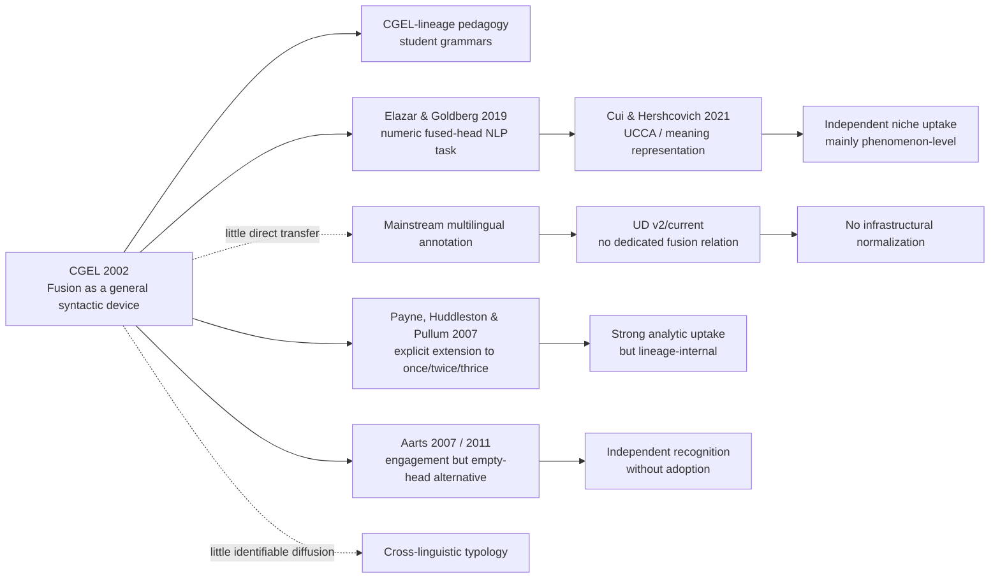

# Uptake of CGEL’s *Fusion-of-Function* Proposal

## Executive summary

The best characterization of the uptake of *The Cambridge Grammar of the English Language*’s fusion-of-function analysis, as of 10 September 2026, is **recognizable but nonstandard: locally entrenched within the CGEL tradition, independently engaged with but not generally adopted in English syntax, selectively borrowed in computational work, and largely absent from mainstream syntactic annotation and cross-linguistic typology**.

That conclusion depends on distinguishing several things that a raw citation search would otherwise conflate. CGEL itself is exceptionally visible: a current bibliographic summary reports more than 8,000 citations to the grammar as a whole. Yet there’s a strikingly thin trail of work that explicitly adopts *fusion of functions* as a representational principle. citeturn32search3 The clearest post-CGEL theoretical elaboration is Payne, Huddleston and Pullum’s 2007 *Journal of Linguistics* article, *Fusion of functions: The syntax of once, twice and thrice*—important evidence that the proposal was developed beyond the specific examples in CGEL, but weak evidence for *independent* uptake because two of the three authors are CGEL’s principal authors and Payne was part of the CGEL project. citeturn30search0turn32search4

Independent grammatical engagement exists, but it more often takes the form of an **explicit alternative**. Bas Aarts’s *Syntactic Gradience* (2007), for example, treats cases such as *the very poor* with an empty nominal head rather than a fused modifier-head; his later *Oxford Modern English Grammar* likewise represents the construction with an empty head. This is good evidence that fusion reached the agenda of another major English grammarian, but not that the analysis became consensual. citeturn31search1turn33search3 More broadly, the competing classification in which standalone *many*, *some*, etc. are pronouns remains widespread in grammars and dictionaries, according to a current secondary synthesis. citeturn30search0turn32search4

The most interesting independent uptake is unexpectedly in NLP. Elazar and Goldberg’s 2019 paper describes itself as the **“first computational treatment of fused-heads constructions”** and develops identification and resolution datasets for numeric fused-heads, including a crowd-sourced resource of about 10,000 examples covering roughly one million tokens. citeturn31academia0 Cui and Hershcovich subsequently examined numeric fused-heads in UCCA meaning representation, finding inconsistency in implicit analysis and arguing for more systematic treatment. citeturn13academia2 This is genuine downstream influence, but with an important qualification: computational work tends to formulate the problem as recovery of a *missing* or implicit nominal head/referent. It therefore borrows the phenomenon and terminology more clearly than it adopts CGEL’s exact architectural claim that an overt constituent simultaneously realizes two syntactic functions.

Mainstream computational infrastructure provides the strongest negative evidence. Universal Dependencies currently defines `det` as a relation between a nominal head and its determiner and provides no universal *fusion* relation. Its enhanced representation explicitly enumerates mechanisms for phenomena such as predicate ellipsis, coordination, control/raising and relatives, but no analogue of a CGEL fused modifier-head or fused determiner-head. citeturn29view1turn29view2 Given UD’s explicit goal of cross-linguistically consistent treebank annotation, that absence is more informative about infrastructural uptake than isolated uses of *fused-head* terminology are. citeturn28academia7

The same distinction matters for *fused relatives*. That term is reasonably familiar, but terminological uptake of *fused relative* shouldn’t be counted automatically as acceptance of CGEL’s general fusion-of-functions mechanism. Free-relative analyses can recognize exactly the same empirical double dependency while representing it through movement, null structure, multidominance, semantic abstraction, or other machinery. The appropriate unit of uptake is therefore **the representational commitment**, not merely recognition of the construction.

My overall assessment is:

| Dimension of uptake | Assessment | Evidential basis |
|---|---:|---|
| Awareness of the phenomenon | **High within English grammar** | CGEL’s prominence; competing grammars explicitly address the same cases. citeturn32search3turn31search1 |
| Use of *fused-head / fusion* terminology | **Moderate, specialized** | Descriptive grammar plus a small NLP literature. citeturn30search0turn31academia0 |
| Independent acceptance of simultaneous syntactic functions | **Low** | Few clear independent adopters; prominent alternative analyses remain. citeturn31search1turn33search3 |
| Adoption in English-syntax teaching | **Moderate inside the CGEL lineage; low-to-uncertain independently** | CGEL-derived student grammars versus Aarts’s empty-head treatment; little discoverable open-course evidence. citeturn31search1 |
| Computational research uptake | **Low but demonstrably real** | 2019 numeric-fused-head datasets and 2021 UCCA follow-up. citeturn31academia0turn13academia2 |
| Corpus/tagset/parser integration | **Very low** | No dedicated representation in current UD basic or enhanced dependencies. citeturn29view1turn29view2 |
| Cross-linguistic/typological uptake | **Very low or at least poorly evidenced** | Searches are dominated by English; multilingual UD doesn't encode the notion as a general relation. citeturn28academia7turn29view2 |
| Overall | **Niche but live; contested rather than rejected** | The proposal has generated extensions and applications, but no field-wide representational convention. |

The crucial asymmetry is thus **CGEL is mainstream enough to be unavoidable; fusion of functions isn't**. The proposal has had much greater *recognition* than *adoption*.

## Analytical scope and what should count as uptake

I haven't reconstructed the primary-text genealogy inside CGEL or surveyed language-teaching/ESL materials, following your clarification. I take the 2002 grammar as the relevant published baseline and concentrate on what happened to the proposal afterwards. CGEL was published by Cambridge University Press in 2002, and contemporary summaries identify fusion as one of its innovative consequences of treating category and syntactic function separately while maintaining pervasive headedness. citeturn32search3

### The proposal whose uptake needs measuring

The distinctive claim isn't merely that an expression such as *many* in *many would disagree* or *poor* in *the very poor* occurs without an overt noun. All major analyses have to describe that fact. The distinctive CGEL move is to say, schematically, that an overt constituent can simultaneously realize the **head function and another function that it characteristically bears in headed constructions**. Thus an adjective phrase can remain adjectival while being a fused modifier-head, rather than undergoing conversion to N, modifying a phonologically null N, or being the remnant of NP ellipsis. Likewise, a determinative can retain its lexical categorization while the relevant constituent bears the combined head/determiner functions. Secondary descriptions of CGEL explicitly identify *the poor* and standalone determinatives such as *many* as paradigm cases of this analysis. citeturn32search3turn32search4turn33search3

That point matters because it gives fusion theoretical work to do. It simultaneously avoids:

1. multiplying lexical categories merely because an item occurs without a noun;
2. positing a syntactically present but phonologically empty nominal merely to satisfy headedness; and
3. abandoning headedness for otherwise ordinary NPs.

Aarts’s alternative illustrates exactly where the theoretical choice lies. For *the very poor*, he keeps an NP and the adjectival status of *poor*, but supplies an empty nominal head; CGEL instead lets the adjective phrase bear modifier and head functions together. citeturn31search1turn33search3 The empirical constituency facts can therefore be largely shared while the ontology of the representation differs.

There’s a corresponding problem in counting *fused relatives*. The descriptive intuition is that a relative expression performs a role in its own clause while participating in the external nominal structure, but a literature that calls *what I bought* a *free* or *fused* relative needn't thereby accept CGEL-style fusion as a general mechanism. Consequently, searches for *fused relative* have high recall but very low precision as measurements of uptake of *fusion of functions*.

### A useful hierarchy of uptake

For assessing influence, I’d distinguish four progressively stronger forms:

| Level | Criterion | Example | What it establishes |
|---|---|---|---|
| **Terminological uptake** | Uses *fused-head*, *fused modifier-head*, etc. | NLP calling numeric NPs *fused-head constructions*. citeturn31academia0 | The CGEL description has entered the vocabulary. |
| **Phenomenological uptake** | Takes the CGEL grouping of cases seriously as a coherent problem | Numeric fused-head identification/resolution. citeturn31academia0 | CGEL has influenced problem formulation. |
| **Analytical uptake** | Accepts an overt constituent as simultaneously realizing the relevant syntactic functions | Payne, Huddleston & Pullum’s extension to *once/twice/thrice*. citeturn30search0 | The fusion mechanism itself is adopted. |
| **Infrastructural uptake** | Encodes fusion in a textbook standard, annotation scheme, corpus or parser architecture | A hypothetical `fused-modifier-head` annotation | The proposal has become reusable disciplinary infrastructure. |

On this scale, the literature gets thinner at each step. There’s clear terminological and phenomenological uptake, considerably less independent analytical uptake, and almost no evidence of infrastructural uptake.

This also explains why simply saying *CGEL has thousands of citations* would badly overestimate adoption. A current secondary source gives CGEL an overall citation count above 8,000, but a citation to CGEL for auxiliaries, complements, prepositions, tense or innumerable other matters contains essentially no information about a researcher's position on fusion. citeturn32search3 Proposal-specific citation contexts are the relevant metric.

## Academic reception and independent engagement

### The 2007 elaboration is important but not independent diffusion

The conspicuous early continuation is John Payne, Rodney Huddleston and Geoffrey K. Pullum’s 2007 *Journal of Linguistics* article *Fusion of functions: The syntax of once, twice and thrice*. It extends the machinery to an unusual lexical-classification problem, arguing that *once*, *twice* and *thrice* belong with compound determinatives rather than simply being adverbs. citeturn30search0turn32search4

This article matters for two reasons. First, it makes *fusion of functions* the explicit subject rather than a local piece of CGEL's NP analysis. Second, it demonstrates that the authors regarded fusion as a reusable grammatical device rather than a notation invented solely for *the poor* or standalone quantificational expressions. citeturn30search0

But for measuring uptake, it should be heavily discounted. Huddleston and Pullum are the principal architects of CGEL, and the article is best understood as **development within the originating research programme**, not evidence that the broader field had accepted the proposal. Counting it equally with an independent author's adoption would exaggerate diffusion.

### Aarts supplies a particularly informative counterfactual

Aarts is more probative because he confronts essentially the same empirical problem from outside the CGEL framework. In *Syntactic Gradience* (2007: 129–136), his analysis of expressions such as *the very poor* treats the adjective phrase as adjectival but supplies an empty N as head. The contrast is explicit in later summaries: Aarts has `NP [the [AP very poor] ∅N]`, whereas CGEL has an overt adjectival constituent realizing the fused modifier-head function. citeturn31search1turn33search3

This isn't wholesale rejection. Both analyses resist the traditional claim that *poor* has simply become a noun; both attempt to preserve the evident adjectival properties of *poor*. The disagreement is narrower and theoretically interesting: **must headedness correspond to a separately represented head constituent, or can headhood be one of two functions borne by the overt dependent-like constituent?** citeturn31search1

That makes Aarts's treatment more useful evidence than a source that merely doesn't mention fusion. It establishes that a prominent syntactician familiar with CGEL found the relevant facts worth accommodating but didn't adopt its representational solution. The same basic alternative appears in the pedagogically oriented *Oxford Modern English Grammar* (2011), so this isn't merely an exploratory position in a specialist monograph. citeturn31search1

### The surrounding grammatical ecosystem hasn't converged on CGEL

Standalone forms such as *many*, *some*, *none*, and similar items are especially revealing because the fusion analysis is tied to CGEL's insistence on separating lexical category from syntactic function. A current synthesis notes that many traditional and modern grammars, and most dictionaries, instead classify the corresponding nounless uses as pronouns. citeturn30search0turn32search4

That is not necessarily a direct *argument* against fusion—the competing descriptions may operate with quite different assumptions about word classes—but it is evidence against **standardization**. If fusion had become the normal analysis, one would expect the lexical classification it is designed partly to support to propagate through reference works. The persistence of pronoun analyses means the field continues to solve the same distributional facts using different category systems.

The *the poor* case displays a parallel three-way competition:

| Analysis | Category of *poor* | Overt NP head? | Additional structure/process | Relation to fusion |
|---|---|---:|---|---|
| Traditional substantivization/conversion | Noun or adjective “used as noun” | Yes, effectively | Recategorization | Rejects the need for fusion |
| Empty-head analysis | Adjective/AdjP | No overt N | Null N head | Direct structural alternative |
| CGEL fusion | Adjective/AdjP | Yes, through fused head function | Simultaneous modifier-head functions | Proposal under investigation |

The case against simple noun classification rests on the continuation of adjectival behaviour: for example, *poor* can occur with *very* in *the very poor*, yet doesn't pattern straightforwardly like an ordinary count noun. The CGEL and Aarts analyses agree on much of that diagnosis while differing in representation. citeturn31search1turn33search3

### Representative sources and their relation to the proposal

| Source | Year | Type | Independence from CGEL authors | Stance / use | Uptake significance |
|---|---:|---|---|---|---|
| Huddleston & Pullum, *CGEL* | 2002 | Major reference grammar | Baseline | Introduces/systematizes fusion as part of its function architecture | Origin point; not uptake. citeturn32search3 |
| Payne, Huddleston & Pullum, *Fusion of functions: The syntax of once, twice and thrice* | 2007 | Journal article | Low | **Supportive extension** | Shows theory-internal productivity, but little independent diffusion. citeturn30search0 |
| Aarts, *Syntactic Gradience* | 2007 | Research monograph | High | **Competing empty-head analysis** | Strong evidence of independent engagement without adoption. citeturn31search1 |
| Aarts, *Oxford Modern English Grammar* | 2011 | Major grammar/textbook | High | **Competing analysis** | Demonstrates persistence of an alternative in syntax instruction/reference grammar. citeturn31search1 |
| Elazar & Goldberg, *Where’s My Head?* | 2019 | NLP paper + datasets/models | High | **Terminological and operational adoption** | First clearly independent computational research programme around *fused-heads*. citeturn31academia0 |
| Cui & Hershcovich, *Meaning Representation of Numeric Fused-Heads in UCCA* | 2021 | Computational semantics/annotation | High | **Follow-up / extension** | Establishes at least a small independent NLP lineage. citeturn13academia2 |
| Huddleston, Pullum & Reynolds, *A Student’s Introduction to English Grammar*, 2nd ed. | 2022 | Syntax/grammar textbook | Low | **Adopts CGEL analysis** | Significant pedagogical transmission, but lineage-internal. citeturn31search1 |
| Universal Dependencies v2 guidelines | current to 2026 search | Multilingual annotation standard | High | **No dedicated fusion representation** | Strong negative evidence for infrastructural adoption. citeturn29view1turn29view2 |

The pattern is unusual but quite coherent: the proposal has attracted **specific engagement disproportionate to the small number of explicit adopters**. It isn't ignored, exactly; rather, scholars working on the relevant constructions often translate the observations into their own representational systems.

## Teaching and reference-grammar uptake

Restricting pedagogy to linguistics and English syntax, rather than language teaching, changes the picture substantially.

Within the CGEL family, fusion is clearly teachable rather than merely a detail buried in the 1,800-page reference grammar. The analysis carries into *A Student’s Introduction to English Grammar*, including its 2022 second edition, and current grammatical summaries cite that student text alongside CGEL in discussion of the relevant constructions. citeturn31search1 That gives fusion considerably more pedagogical exposure than many highly local analyses in large reference grammars receive.

But this is **vertical transmission inside a framework**, not horizontal convergence among textbooks. Aarts's *Oxford Modern English Grammar* is the most useful comparator because it covers much the same domain at a similar level while maintaining an empty-head analysis for the adjectival construction. citeturn31search1turn33search3 The presence of an explicit alternative in a major independent grammar is exactly what one wouldn't expect if fused modifier-head had become a routine piece of undergraduate syntactic metalanguage.

The broader reference-work evidence points in the same direction. For nounless determinatives, classifications as pronouns remain widespread rather than the CGEL combination of stable lexical category plus fused syntactic functions. citeturn30search0turn32search4 Such classification differences are partly theory-dependent, so they shouldn't be counted as straightforward empirical rejection. But from the narrower question of *uptake*, that distinction doesn't matter: they show that fusion hasn't become a default descriptive convention.

My searches of publicly indexed syntax-course and university teaching material didn't produce enough identifiable independent instances of *fused modifier-head*, *fused determiner-head*, or *fusion of functions* to support a meaningful syllabus count. That is an **evidence gap rather than proof of absence**: university LMS material is poorly indexed, slides frequently sit behind authentication, and textbook chapters are more searchable than course exercises. A claim like “fusion appears in X% of English syntax courses” isn't defensible from public-web evidence.

Still, the asymmetry itself is informative. Terms such as *subject*, *predicative complement*, *determiner*, *head*, *NP*, and even more framework-specific ideas leave large footprints in open course notes. Fusion doesn't. Combined with the clear Aarts alternative and continued pronoun analyses, the safest pedagogical characterization is **established in CGEL-oriented syntax teaching, exposed rather than standardized elsewhere**.

There’s therefore no good basis for describing fusion as a routine element of “modern English grammar teaching” tout court. A better description is **a distinctive CGEL analysis that students increasingly can encounter because CGEL has a pedagogical ecosystem of its own**.

## Computational linguistics, corpora, and parsers

This is the clearest case where the proposal has travelled beyond English descriptive grammar, although what travelled is slightly different from the original theory.

### Numeric fused-heads became an NLP task

Elazar and Goldberg's 2019 *Where’s My Head? Definition, Dataset and Models for Numeric Fused-Heads Identification and Resolution* explicitly presents itself as the **“first computational treatment of fused-heads constructions”**. They focus on numeric fused-heads and divide the problem into identification and resolution. Their work draws examples from large English corpora, constructs a high-accuracy identification procedure, creates a crowd-sourced resolution dataset of about 10,000 examples/one million tokens, and supplies a neural baseline. citeturn31academia0

Chronologically, that wording is revealing. The first computational paper explicitly centred on fused-heads appears in 2019, seventeen years after CGEL. This is evidence of eventual interdisciplinary transfer, but not of rapid or broad computational adoption. citeturn31academia0turn32search3

More importantly, Elazar and Goldberg operationalize the construction as one in which “the head noun is missing” and the model must recover the implicit information. citeturn31academia0 That formulation is natural for an NLP resolution task but analytically shifts the target. CGEL's point is precisely that an NP can have an overt head **function** without having an overt constituent of category N/Nominal in the head slot. The NLP problem instead asks what implicit nominal information a human supplies in interpretation.

I therefore wouldn't code Elazar and Goldberg as uncomplicated theoretical endorsement. I’d code the paper approximately as:

**terminology: adopted; constructional grouping: adopted; motivation that ordinary syntax underrepresents something semantically recoverable: adopted; exact CGEL syntactic representation: indeterminate.**

That distinction is important for bibliometrics. A citation-context analysis that classified the paper simply as “supportive” would inflate analytical uptake.

### UCCA provides a small downstream research lineage

Cui and Hershcovich's 2021 work on *Meaning Representation of Numeric Fused-Heads in UCCA* demonstrates that the 2019 study wasn't an isolated terminological borrowing. They investigated how numeric fused-heads are handled in UCCA meaning representation, finding inconsistent behaviour in implicit parsing and considering whether the difficulty arises from annotation practice, limited data, or modelling. Their recommendations include more systematic, fine-grained treatment of the construction. citeturn13academia2

This is probably the strongest evidence for a genuine **micro-lineage of computational uptake**: a CGEL-associated construction gets named, operationalized as a dataset/task, and then becomes the object of a separate study of semantic annotation.

Again, however, UCCA's interest is in recovering implicit semantic material. It doesn't show that general-purpose parsers have started representing one surface constituent as *modifier + head* or *determiner + head* in the CGEL sense. The influence is downstream at the level of **phenomenon identification and semantic incompleteness**, not syntactic architecture. citeturn31academia0turn13academia2

### Universal Dependencies is a useful stress test

Universal Dependencies provides a much stronger test of whether fusion has become computationally infrastructural. UD is explicitly intended as a cross-linguistically consistent system of morphological and syntactic annotation; the UD v2 overview describes layers of word segmentation, POS/morphology and syntactic relations across multilingual treebanks. citeturn28academia7

Its present guidelines define `det` straightforwardly as a relation “between a nominal head and its determiner”. citeturn29view1 Current enhanced UD explicitly enumerates devices for making several kinds of implicit relation overt: null nodes for elided predicates, propagation through coordination, subjects of control/raising constructions, coreference in relatives, and enriched modifier labels. Fusion isn't among those mechanisms. citeturn29view2

UD does have an `orphan` relation, but that addresses head ellipsis—canonically predicate ellipsis such as *Marie won gold and Peter bronze*—where promotion of another element would otherwise create a misleading relation. It isn't a CGEL-style dual-function relation. citeturn29view0

This permits a fairly strong, though explicitly inferential, conclusion: **current mainstream dependency annotation doesn't operationalize CGEL fusion as fusion**. A parser producing UD can of course analyse the same surface expressions, and a downstream model can infer the same semantic relationships, but the CGEL generalization isn't encoded as an object in the annotation inventory. citeturn29view0turn29view1turn29view2

That matters more than whether a few computational papers use the word *fused*. Once a proposal has achieved infrastructural uptake, datasets make it reproducible, annotator guidelines make it teachable, parsers produce it, and downstream researchers inherit it without needing to endorse the original paper. There’s no evidence that fusion has crossed that threshold.

## Cross-linguistic reach and subfield variation

The evidence varies far more clearly by **research tradition** than by country. I wouldn't infer reliable geographic rates from the available literature.

### Cross-linguistic and typological work

My targeted searches produced little evidence that *fusion of functions* has become a reusable typological construct of the sort that one finds applied across unrelated languages. Search results remained overwhelmingly centred on English nominal syntax, CGEL-related discussion, the *once/twice/thrice* paper, and the numeric-fused-head NLP line. The multilingual reach of Universal Dependencies makes the lack of a dedicated fusion relation particularly suggestive: UD was already covering 90 languages in its 2020 v2 overview, yet its current universal machinery doesn't elevate function fusion to an annotation primitive. citeturn28academia7turn29view2

That isn't evidence that other languages lack phenomena for which a CGEL-style analysis *could* be attractive. On the contrary, languages commonly have substantivized modifiers, determiner-like nominals, nominal ellipsis, free relatives and constructions in which category and distribution don't line up neatly. The negative result concerns **diffusion of this particular analysis**, not applicability.

There’s also a search-precision problem. *Fusion* is used independently in morphology, syntax, construction grammar and typology for several unrelated ideas, while *fused relative* overlaps with the much broader literature on free relatives. Those aren't valid hits unless the author either invokes the CGEL analysis or clearly lets one overt syntactic constituent bear the two relevant grammatical functions.

On a strict definition, then, cross-linguistic adoption appears **very sparse**. On a loose definition that counts anyone calling free relatives *fused*, it would appear much larger—but that would answer a different question.

### Syntax versus morphology

Within **descriptive English syntax**, fusion has substantial visibility because it interacts with several of CGEL's characteristic commitments: category/function separation, NP rather than DP headedness, lexical-class diagnostics, and reluctance to posit unmotivated empty structure. The existence of Aarts's explicit alternative shows that the relevant analytical choice is visible even where fusion isn't adopted. citeturn31search1turn32search3

Within **mainstream theoretical syntax**, the situation is less favourable to direct uptake. An analyst who already allows empty nominal heads, DP headedness, category-changing nominalization or movement/ellipsis has less motivation to add function fusion as a primitive. Aarts supplies a concrete empty-head example; the continued prominence of DP analyses in the larger syntactic literature further reduces the specific theoretical work that CGEL's device needs to perform. citeturn31search1turn28search4 This is not evidence that those frameworks have disproved fusion. It is an explanation for why an analysis can be elegant inside CGEL's architecture yet fail to migrate into frameworks with different representational economies.

**Morphology and lexical categorization** receive one unusually clear extension through *once, twice and thrice*. Payne, Huddleston and Pullum use fusion as part of the argument that these forms belong with compound determinatives rather than simply being adverbs. citeturn30search0 I found much less evidence that this seeded a general programme of morphological research under the *fusion-of-functions* label.

### Semantics and relative constructions

The route into **semantics** is mainly indirect. Fused/free relatives inherently raise questions about a constituent's internal relative-clause role and the interpretation of the larger phrase, but the semantic literature doesn't need to accept CGEL's syntactic function labels to address those issues. Numeric fused-head NLP provides the clearer semantic continuation because the problem is explicitly framed in terms of recovering implicit referential information. citeturn31academia0turn13academia2

That yields a revealing disciplinary reversal: the more fusion is treated as a **surface syntactic representational claim**, the less independent uptake is visible; when reformulated as a **missing-information or interpretation problem**, it has proved somewhat more portable.

### Subfield comparison

The following ratings aren't bibliometric proportions. They're ordinal judgments from the evidence reviewed here, with *adoption* reserved for acceptance of the analytic machinery rather than mere discussion.

| Subfield | Recognition | Independent engagement | Explicit analytical adoption | Durable infrastructure | Overall |
|---|---:|---:|---:|---:|---|
| English descriptive grammar | High | Moderate | Low–moderate | Low | **Contested but established** |
| Theoretical syntax | Moderate | Moderate | Low | — | **Alternative, not standard** |
| English-syntax pedagogy | Moderate | Moderate | Low independently | — | **Framework-dependent** |
| Morphology/lexical categorization | Low–moderate | Low | Low | Low | **Highly localized** |
| Computational syntax/NLP | Low–moderate | Moderate in NFH niche | Indeterminate | Very low | **Small but real uptake** |
| Computational semantics | Low | Low–moderate | Not really the same representation | Low | **Phenomenon-level uptake** |
| Cross-linguistic typology | Low | Low | Very low | Very low | **No clear diffusion** |

This distribution argues against both extreme descriptions. *Widely adopted* is untenable because competing analyses and incompatible annotation conventions remain dominant. *Ignored* is also wrong because the proposal has prompted an explicit journal extension, a serious competing analysis, textbook treatment and a small computational research programme. citeturn30search0turn31search1turn31academia0turn13academia2

## Metrics, trajectory, and overall characterization

### What citation numbers can and can't establish

The easiest quantitative number is also the least useful: a current secondary bibliographic summary says CGEL has been cited more than 8,000 times. citeturn32search3 That establishes enormous exposure to the *host work*. It doesn't tell us how many of those citations concern fusion.

I wasn't able to recover sufficiently reliable and contemporaneous citation totals for the 2007 Payne–Huddleston–Pullum paper, the 2019 Elazar–Goldberg paper, and the 2021 Cui–Hershcovich paper from openly indexed records to justify putting precise numbers in a comparative table. Google Scholar/Semantic Scholar result exposure was inconsistent, and cross-index citation counts aren't interchangeable. Reporting an apparently precise count from one unstable snippet would give a false impression of measurement quality.

For this particular question, **citation contexts are much more diagnostic than citation totals anyway**. The following distinctions would be worth maintaining in any systematic bibliometric follow-up:

| Citation/context type | Example in present evidence | Should count as adoption? |
|---|---|---|
| CGEL cited for unrelated grammar | Most possible CGEL citations | **No** |
| Fusion named descriptively | Discussion of *fused modifier-head* | **Weakly** |
| Fusion contrasted with another analysis | Aarts's empty-head alternative | **Engagement, not adoption**. citeturn31search1 |
| Fusion extended using the same architecture | Payne et al. 2007 | **Yes, but lineage-internal**. citeturn30search0 |
| Construction borrowed as research target | Elazar & Goldberg 2019 | **Yes at phenomenon level**. citeturn31academia0 |
| Follow-up computational study | Cui & Hershcovich 2021 | **Yes at phenomenon level**. citeturn13academia2 |
| Annotation scheme represents dual functions directly | No clear mainstream example found | **Strong adoption, if found** |
| Scheme represents same cases differently | UD | **Evidence of non-adoption of the representation**. citeturn29view1turn29view2 |

For a rigorous citation study, I would therefore regard an exact-phrase/citation-context corpus centred on *fusion of functions*, *fused modifier-head*, *fused determiner-head*, *fused-head*, plus citations to Payne et al. 2007 as much more valid than counting all papers containing *fused relative*. The dependent variable should distinguish *accept*, *extend*, *compare*, *reject/replace*, *borrow terminology only*, and *unclear*.

### Adoption trajectory

The timeline makes the pattern clearer than cumulative citation counts would:

**2002 — CGEL.** Fusion is placed within a larger architecture in which categories and functions are independently labelled and headedness is preserved without treating every apparent headless NP as ellipsis or conversion. citeturn32search3turn33search3

**2007 — two divergent developments.** Payne, Huddleston and Pullum explicitly extend fusion in *Journal of Linguistics*, while Aarts independently works on closely related constructions but uses empty nominal structure instead. citeturn30search0turn31search1 This is perhaps the most telling moment: the proposal is intellectually visible, but convergence doesn't follow.

**2011 — alternative enters a major pedagogical/reference grammar.** Aarts's *Oxford Modern English Grammar* keeps the competing type of analysis in circulation. citeturn31search1

**2019 — computational rediscovery/transfer.** Elazar and Goldberg introduce what they describe as the first computational treatment of fused-head constructions, concentrating on numerals and building reusable data. citeturn31academia0 The seventeen-year interval is inconsistent with fusion having become a routine computational representation, but the dataset creates a new kind of uptake.

**2021 — computational follow-up.** Numeric fused-heads become the object of work on UCCA meaning representation rather than remaining a one-paper curiosity. citeturn13academia2

**2022 — continued CGEL pedagogical transmission.** The analysis remains part of the CGEL-derived student-grammar tradition. citeturn31search1

**2026 — no sign of infrastructural normalization.** Current UD v2 documentation still provides no dedicated representation of fusion among either basic universal relations or the enumerated enhanced mechanisms. citeturn29view1turn29view2

### Uncertainties and negative evidence

Several limitations matter.

First, **books are undercounted** by web-centred searches. English grammar remains unusually book-heavy, so an article-only bibliography would be misleading. Aarts is a good example of why monographs matter. citeturn31search1 There may be additional syntax textbooks that adopt CGEL's terminology without leaving searchable snippets.

Second, **syllabus evidence is particularly weak**. Absence from publicly indexed university course pages shouldn't be converted into an adoption percentage. The defensible finding is simply that no broad, independently verifiable footprint comparable to established syntax terminology emerged from the search.

Third, **terminology is a major confound**. Searching *fusion of functions* gives precision but misses authors who adopt the structure under another name. Searching *fused relative*, *nominal ellipsis* or *substantivized adjective* gives recall but floods the sample with analyses that aren't CGEL fusion. A definitive bibliometric study would need manual coding.

Fourth, **computational uptake can change theoretical content while retaining the name**. Elazar and Goldberg's formulation in terms of a missing head to be resolved is useful computationally but isn't equivalent to saying that an overt constituent synchronically bears two syntactic functions. citeturn31academia0turn32search3 The 2019 and 2021 papers therefore shouldn't be treated as two votes for CGEL's syntax.

Fifth, **the negative UD result is architectural rather than construction-by-construction**. The current official inventory doesn't provide a CGEL fusion mechanism, but I haven't manually inspected every relevant token in every English UD treebank. The warranted conclusion is that fusion hasn't been standardized in UD's public representational vocabulary, not that no individual treebank annotation could ever be translated into a fused analysis. citeturn29view0turn29view1turn29view2

Finally, **geographic evidence is too sparse to support claims such as “more accepted in Britain than North America.”** What can be supported is a subfield effect: CGEL-oriented English grammar carries the concept strongly; an independent British English-grammar tradition represented by Aarts explicitly supplies an alternative; independent NLP researchers have reused the *fused-head* problem; and a major international multilingual annotation standard hasn't incorporated the analysis. citeturn31search1turn31academia0turn29view2 That is a disciplinary pattern, not a national one.

### Final characterization

Calling fusion of functions **widely adopted** would conflate the enormous success of CGEL with acceptance of one of its more distinctive representational proposals. The evidence doesn't support that. CGEL's visibility exceeds 8,000 citations by one current secondary count, yet the readily identifiable literature centred specifically on fusion is small, its most explicit early extension comes from the originating circle, a major independent grammarian chooses an empty-head alternative, and current mainstream multilingual syntactic annotation has no fusion mechanism. citeturn32search3turn30search0turn31search1turn29view2

Calling it **rejected** would be equally misleading. There isn't evidence of a sustained literature demonstrating that fusion fails. Instead, competing frameworks can capture much the same distributional evidence with empty categories, pronoun classifications, DP structure, nominalization or ellipsis. Aarts's work exemplifies analytical competition rather than an empirical refutation. citeturn31search1turn33search3

Nor is **ignored** right. The mechanism was explicitly generalized in a major syntax journal; it survives in CGEL-oriented syntax pedagogy; independent computational linguists adopted *fused-head* as the name and organizing concept for a concrete NLP problem; they built substantial datasets around it; and that work generated at least one identifiable follow-up in semantic annotation. citeturn30search0turn31academia0turn13academia2

I would therefore characterize the uptake as **niche, selective, and contested, with unusually high recognition relative to actual theoretical adoption**. More precisely:

> **Fusion of functions is an established CGEL-family analysis and a recognizable option in English grammatical description, but it hasn't become a general syntactic convention. Its strongest independent diffusion has been phenomenon-level rather than architecture-level: researchers sometimes inherit the empirical grouping and the *fused-head* label while translating the phenomenon into empty-head, implicit-information, semantic-resolution, or other representational terms.**

That final distinction seems to capture the evidence better than a simple adopted/rejected scale. The proposal's **descriptive generalization has travelled farther than its ontology**. In syntax proper, it remains one solution among competing analyses; in pedagogy, it is robust where CGEL provides the metalanguage but not independently standardized; in NLP, it has generated a small but genuine research line without entering mainstream treebank architecture; and in typology, there is as yet little evidence that *fusion of functions* has become a portable cross-linguistic analytical primitive. citeturn31search1turn31academia0turn13academia2turn29view2